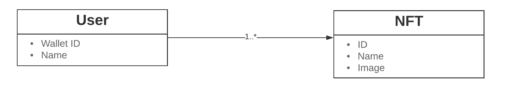
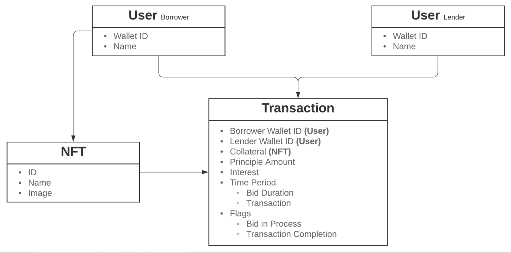
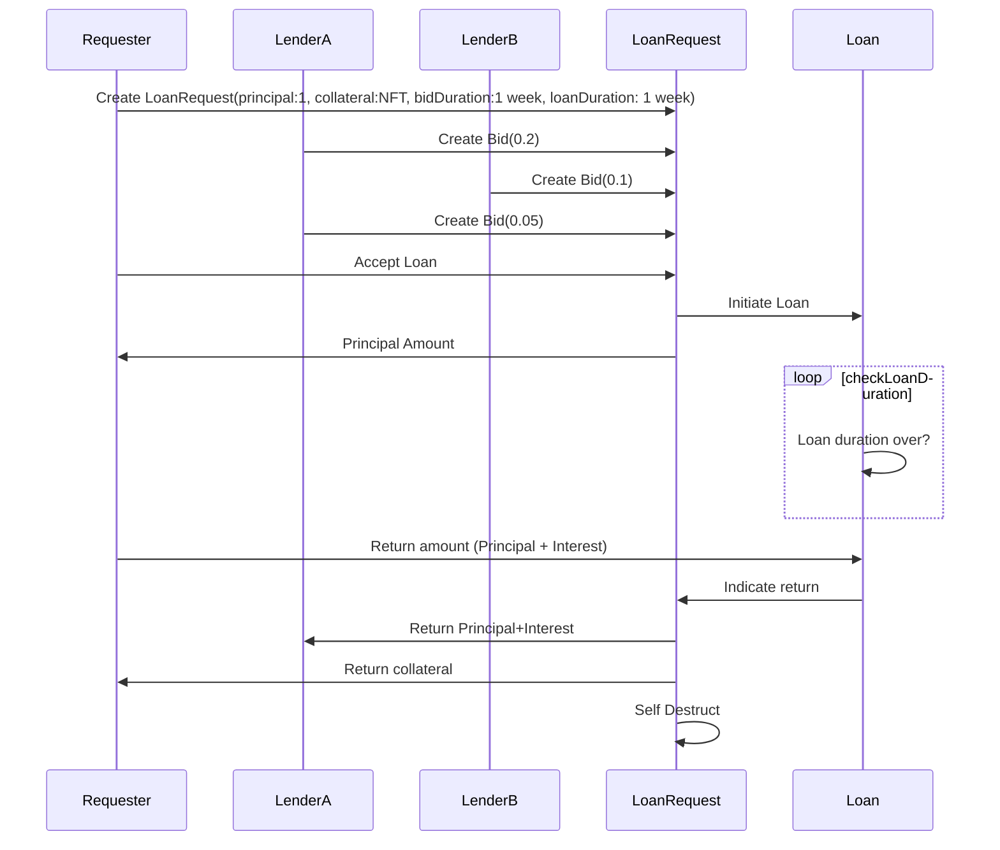

# Loan Piranhas

# Beaches and Barbells

**Aakash Aanegola
Dhruv Kapur
Ritvik Aryan Kalra
Sidharth Giri
Arihanth Srikar Tadanki**

Business owners typically face a roadbump when they try to get their businesses up and running. Finding seed capital without staking irrational stakes in their nascent businesses or paying unreasonable interest rates is rather difficult, and more often than not businesses end up failing due to a lack of seed capital or gargantuan debt, with the loan sharks turning a profit at the expense of the business owners. 

To solve this problem, we propose a novel loan system over the blockchain, where business owners can choose to stake collateral and receive ‘bids’ for loans. We believe that using a distributed system in order to implement our loan system helps improve transparency and also helps build a community of Indian business owners who can collectively build value while helping the country progress. 

### Solution Flow

**Borrower creates loan request**

The loan request consists of the loan amount, a collateral token, an end date for bidding and a “payable by” date which indicates when the requester will return ether. 

On creation of the loan request, the following happens:

- A smart contract is created that locks in the collateral
- A database entry is created for the request that accrues bids over time

**Lender activity**

Lenders can see all the requests that are currently live, and the information attached with them (the staked collateral, the current bid etc.)

*A bid is essentially the interest rate that the lender is willing to provide ether at, and the rate at which it is compounded.* 

If the lender is interested in making a bid, they can initiate a bid on which: 

- The ether of the previous bidder is returned, and the contract locks in the ether of the current bidder
- A new entry is created for the bid in the database that’s linked to the request object to ensure traceability.

**Loan request time frame ends**

Once the end date for the bidding is reached, the request is no longer available to bid on and the requester can view the best bid. The requester can either 

- Accept the bid, on which the ether is transferred to the requesters wallet and a timer for return is initiated. The requester will also be able to view the current payable amount, based on how the interest is being computed.
- Reject the bid, on which the smart contract self destructs, and all database entries related to the request are removed. The lenders ether is also returned.

**Loan request end data reached**

The borrower must return the funds along with the accrued interest by the payable date. 

- If they fail to do so, the ownership of the collateral is transferred to the lender and the contract self destructs.
- If they return the ether by the payable date, the collateral is returned to the borrower, the ether is returned to the lender (along with the accrued interest) and the contract self destructs.

### Tech stack

Our solution is serverless in the spirit of decentralization. 

- **Frontend:** Next.js
- **Database:** GraphCMS
- **Web 3.0/Smart Contracts:** Solidity

### Database schema

Users are represented using their unique wallet ID and have their names associated with them. Each user can have their own multiple NFTs, which could be used as collateral for taking loans.

A transaction is associated with a smart contract. It takes two users, a borrower, and a lender. The borrower provides collateral in the form of an NFT. The bidding takes place for the bidding duration where we have several users pitching in with their interest amounts. 

### Sample loan sequence

### Testing the smart contracts

To ensure that our smart contract life cycle was working as planned we created a series of test that we ran locally and verified the functioning of the different actions that entities can take. The outputs within the code cells represent the output of our test scripts at each stage, along with which we have provided a short explanation. 

1. **Initializing the minter smart contract**
`Contract deployed to address: 0x5FbDB2315678afecb367f032d93F642f64180aa3
****`This indicates that the NFT minting contract is up and running, and the hex string corresponds to the address of the contract. 
2. **Adding an NFT to a simulated users account** 
`Adding token to 0xf39Fd6e51aad88F6F4ce6aB8827279cffFb92266
Minted NFT
Token ID: 0x0000000000000000000000000000000000000000000000000000000000000001`
As we can see, an NFT (represented by the token ID) has been added to a simulated account (represented by the hex string)
3. **Deploying the loan contract
`Contract deployed to address: 0x9fE46736679d2D9a65F0992F2272dE9f3c7fa6e0`**
When a user decides that they require capital, they initiate a loan request which is controlled by a smart contract on the block chain. In this step, the loan request contract is created and deployed but is still incomplete as it doesn’t have any corresponding NFT staked as collateral. This process had to be split as the loan contract has to be given the ability to change the ownership of the NFT which cannot be performed within the constructor. 
4. **Authorizing the loan address**
For the loan contract to be able to control the ownership of the smart contract we need to authorize the address of the loan contract. 
5. **Staking Collateral**
`Staking collateral...
Asset Staked!`
The collateral (in the form of an NFT) has to be transferred to the smart contract for the duration of the loan (both the bidding and active loan periods). 
6. **Check the ownership of the NFT
`Owner: 0x9fE46736679d2D9a65F0992F2272dE9f3c7fa6e0`**
As we can see, the NFT is owned by the smart contract (the address corresponds to the contract address obtained in test 3) which indicates that the collateral is being held in escrow by the contract. 
7. **Place bid**
`Wallet Balance: 10000.0
Placing Bid
Placed bid
Wallet Balance: 9998.999894092299250864`
Here another user decides to place a bid on the loan request (interest amount is 0.1 eth). As we can see, their wallet balance indicates the principal amount (1 eth) deduction along with some gas fees for making a transaction. 
8. **Accept bid**
`Wallet Balance: 9999.993688166065500182
Accepting Bid
Accepted bid
Wallet Balance: 10000.993611348715916969`
When the requester of the loan accepts the terms of the bid, their wallet balance reflects the deposited amount, and now the loan is in its active phase. 
9. **Loan termination**
The loan can be terminated in one of two ways: 
    - The borrower returns the principal along with the accrued interest
    `Wallet Balance: 10000.993611348715916969
    Terminating Loan (from Borrower)
    NFT Returned
    Wallet Balance: 9999.893394229504527665`
    In this case the borrower obtains their original collateral NFT and pays back the lender. The updated balances stand as follows: 
    `Contract Address: 0.0 ethers
    NFT Ownership: Borrower
    Lender Address: 10000.099894092299250864 ethers
    Borrower Address: 9999.893394229504527665 ethers`
    - The lender claims the NFT 
    `Wallet Balance: 9998.999894092299250864
    Terminating Loan (from Lender)
    Compensated with NFT
    Wallet Balance: 9998.999708082584064016`
    In this case the borrower doesn’t return the money, and ownership of the NFT is granted to the lender. The lender has to pay the gas fees and the updated balances stand as follows: 
    `Contract Address: 0.0 ethers
    NFT Ownership: Lender
    Lender Address: 9998.999708082584064016 ethers
    Borrower Address: 10000.993611348715916969 ethers`